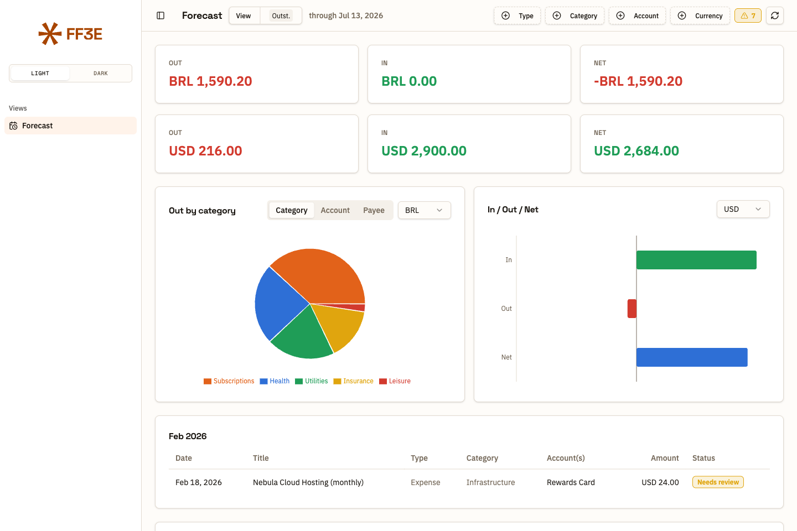

# Entropy for Firefly III



**[Live demo →](https://ff3e.42labs.io)** — 100% synthetic data, no Firefly III instance behind it.

**What's still outstanding — overdue and upcoming, in one place.**

Firefly III records every transaction you've made and knows all your recurring
ones — rent, salary, that streaming subscription. But it won't lay the recurring
ones out in front of you and tell you which are quietly overdue and which are
still ahead.

Entropy for Firefly III does exactly that, and nothing else. It's a read-only
view that **complements** Firefly III: point it at your instance, and it projects
every recurring transaction forward, matches each expected occurrence against
your real booked transactions, and then shows you **only what's left** — the
outstanding set.

Every occurrence you see is in one of two states:

| Status | Meaning |
| --- | --- |
| **Upcoming** | Due in the future. Nothing to do yet. Finite installments show how many payments remain. |
| **Needs review** | Its date has passed and no payment accounts for it. |

When an occurrence *does* match a real transaction, it's confirmed — and it
simply drops out of the view. Entropy shows what's outstanding, not what's
already done: the done half already lives in Firefly III, and Entropy doesn't
restate it.

"Needs review" is the point of the whole thing. Entropy for Firefly III never
guesses. It marks an occurrence paid by the **account that paid it, not the
amount** — so a bill whose amount drifts, or that you paid late or in the next
month, still counts; each real payment clears the earliest still-open occurrence.
Credit-card installments have no payment of their own — they clear when the card
bill (fatura) they were charged to is settled. If nothing accounts for an
occurrence once its date has passed it says so, and if a payment can't be
attributed cleanly (a shared or noisy account) it flags it — instead of
pretending either way.

### Card billing cycles

A card bill covers the *previous* cycle: charges up to a closing date, paid a
week or so later. So the month a fatura is paid in tells you nothing about which
charges it covered, and the closing day is the issuer's choice — one real card
closed on the 10th one month and the 13th the next. Entropy therefore does not
compute cycles. It reads them from the card account's **notes** in Firefly III,
one row per fatura, exactly as the statement prints them:

```
cycle: close=2026-06-10 due=2026-06-20 total=21788.40
cycle: close=2026-07-13 due=2026-07-20 total=26139.84
```

`total` is optional; when present, the payload reports how much of it the
recurring charges accounted for, so an over- or under-clear is visible. Each
fatura also prints the *next* closing date, so the table can always be kept one
cycle ahead.

A settlement (a transfer into the card described as a payment) clears the
earliest still-unpaid cycle that had already closed when it was made and whose
successor was not yet due. A payment late by up to a full cycle still counts; a
minimum paid days before the full payment is absorbed rather than counted twice;
and an on-time payment can't quietly absorb a cycle you skipped.

**A card with no cycle rows clears nothing** — its occurrences stay outstanding,
flagged `cycle_unknown`. Unknown is reported, never guessed.

## What you see

- **Day / Month / Year** — one period at a time, with a picker to jump anywhere.
- **Overdue** — everything unconfirmed and already due, including the months
  behind you.
- **Due this month** — the same, plus what's still ahead this month.
- A **Dashboard** (per-currency totals + charts) you can show or hide; the item
  list is always there.
- Filter by type, category, **asset account** or currency; totals never
  cross-sum currencies. (The account facet lists only your own asset accounts —
  the paying/receiving side — never expense or revenue counterparties.)

## Run it

You need a Firefly III instance and a Personal Access Token
(*Options → Profile → OAuth → Personal Access Tokens*).

```bash
git clone https://github.com/4242labs/ff3e.git
cd ff3e
cp .env.example .env      # add your FIREFLY_III_URL and FIREFLY_III_TOKEN
docker compose up
```

Then open <http://localhost:8000>.

## How it fits together

```
browser ──▶ Entropy server ──▶ Firefly III REST API
  (SPA)     (forecast engine)   (your data, untouched)
```

The server exists for one reason: Firefly III authenticates with a token that
must never live in browser code, and it doesn't send CORS headers — so the
browser can't call it directly. The Entropy server holds the token, reads, and
hands back JSON. **It writes nothing back to Firefly III.** Your recurring
transactions can stay paused; they'll never auto-post because of this.

The entire Firefly III coupling is two functions in `server/forecast.py` —
`fetch_recurrences()` and `fetch_transactions()`. Everything else is
ledger-agnostic.

## Develop

```bash
# server
cd server && pip install -r requirements.txt
FIREFLY_III_URL=... FIREFLY_III_TOKEN=... uvicorn main:app --reload

# web (proxies /api to :8000; falls back to synthetic fixtures if nothing's there)
cd web && npm install && npm run dev
```

Vite · React · TypeScript · Tailwind v4 · shadcn/ui · Recharts.
Fixtures in `web/src/fixtures/` are synthetic — no real financial data.

`npm run build:demo` builds a fully static bundle with no server dependency:
`fetchForecast` short-circuits straight to the fixtures, so the demo works
from a plain static host (this is what powers the GitHub Pages demo above).
`web/src/fixtures/projections-demo-story.json` is the fixture behind it — a
hand-written, entirely fictional forecast with an overdue backlog, a couple
of needs-review items, and both income and expenses, so a first-time visitor
sees the product's whole point without connecting anything.

## Configuration

| Variable | Default | |
| --- | --- | --- |
| `FIREFLY_III_URL` | — | Your instance, no trailing slash. **Required.** |
| `FIREFLY_III_TOKEN` | — | Personal Access Token. **Required.** |
| `MATCH_DAYS` | `5` | Fetch padding — how far past the window edges transactions are still pulled in (so an occurrence near an edge can still be accounted for). Matching itself is amount- and date-blind. |
| `FIREFLY_CF_ACCESS_CLIENT_ID` | — | Optional. Set both CF-Access vars if your Firefly III sits behind a Cloudflare Access service token; the pair is added as request headers. Unset → not sent. |
| `FIREFLY_CF_ACCESS_CLIENT_SECRET` | — | Optional. See above. |
| `PORT` | `8000` | Host port. |

### Consuming this as a downstream app

You can run this repo **unmodified** and mount it inside another app (behind your own auth, under a
subpath) purely via build-time flags — no fork needed. Set these when running `npm run build` in `web/`:

| Build flag | Default | |
| --- | --- | --- |
| `VITE_BASE` | `./` | Public base path when the SPA is mounted under a subpath, e.g. `/entropy/`. |
| `VITE_API_BASE` | `api/forecast` | The forecast endpoint the SPA calls (override if you proxy it elsewhere, e.g. `/projections/data`). |
| `VITE_AUTH_RELOAD` | off | Set to `1` when the server sits behind an auth proxy (e.g. Cloudflare Access): an expired session (opaque redirect / non-JSON) triggers a one-shot reload to re-authenticate instead of a stuck error. |

## License

Open source — [AGPL-3.0](LICENSE). Commercial — contact ahoy@42labs.io.
Both, in full: [LICENSING.md](LICENSING.md).

---
Built by [42labs](https://github.com/4242labs). Not affiliated with
[Firefly III](https://github.com/firefly-iii/firefly-iii).

---
If it earned its keep, [coffee is appreciated](https://buymeacoffee.com/42piratas). ☕
