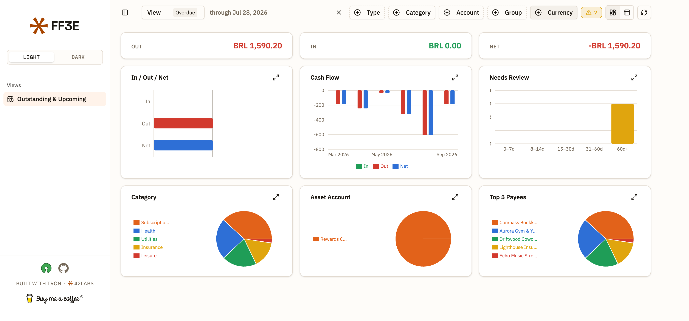
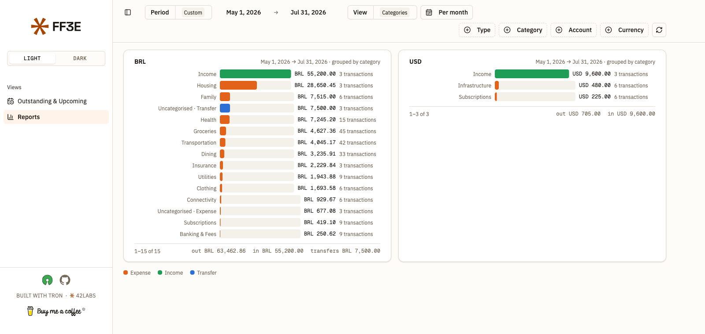

# Entropy for Firefly III



**[Live demo →](https://ff3e.42labs.io)** — 100% synthetic data, no Firefly III instance behind it.

**What's still outstanding — overdue and upcoming, in one place.**

Firefly III records every transaction you've made and knows all your recurring
ones — rent, salary, that streaming subscription. But it won't lay the recurring
ones out in front of you and tell you which are quietly overdue and which are
still ahead.

Entropy for Firefly III does exactly that. It's a read-only view that
**complements** Firefly III: point it at your instance, and it projects every
recurring transaction forward, matches each expected occurrence against your
real booked transactions, and then shows you **only what's left** — the
outstanding set.

Two views, and they answer opposite questions:

| View | Question | Reads |
| --- | --- | --- |
| **Outstanding & Upcoming** | what is *coming*, and what quietly slipped | your recurring transactions, projected |
| **Reports** | what actually *happened* over a window | your booked transactions, ranked |

Both are read-only. Entropy writes nothing back to Firefly III, ever.

Every occurrence you see is in one of two states:

| Status | Meaning |
| --- | --- |
| **Upcoming** | Due in the future. Nothing to do yet. Finite installments show how many payments remain. |
| **Needs review** | Its date has passed and no payment accounts for it. |

When an occurrence *does* match a real transaction, it's confirmed — and it
simply drops out of the view. Entropy shows what's outstanding, not what's
already done: the done half already lives in Firefly III, and Entropy doesn't
restate it.

"Needs review" is the point of the whole thing. Entropy for Firefly III never
guesses. It marks an occurrence paid by the **account that paid it, not the
amount** — so a recurring transaction whose amount drifts, or that you paid
late or in the next month, still counts; each real payment clears the earliest
still-open occurrence.
If nothing accounts for an occurrence once its date has passed it says so, and if
a payment can't be attributed cleanly (a shared or noisy account) it flags it —
instead of pretending either way.

### Credit-card installments (parcelado)

An installment lives in Firefly III the moment it is charged: a real card
withdrawal, dated on the statement, carrying its own parcela number (`installment
N/M` in the description, or an `installment:<total>:<current>` tag). Entropy keeps
**no parallel forecast object** for it — that second copy fired on a different day,
fell into a different billing cycle, and double-counted the current month. Instead
the forecast is a pure function of the booked charges: it reads the **latest
parcela of each active plan** (off the last closed statement, plus brand-new plans
off the still-open one) and projects only the **unbilled tail**, parcelas `N+1 … M`,
onto the coming statement dates. A charge already in the ledger is never also
projected, so an installment can never be counted twice.

Nothing is inferred. The total `M` and number `N` come from the charge itself; a
charge that states no installment is an ordinary one-off and is never projected, and
a plan whose total is unknown projects nothing. Concurrent identical plans stay
distinct (three `8/12` charges are three plans). Past the last issued statement the
exact date isn't known, so the tail falls monthly and is flagged `cycle_projected`.

Open-ended card charges — a subscription with no finite `N` — are the exception:
they *are* recurrences, and they still clear against the paid billing cycle below.

### Card billing cycles

A card statement covers the *previous* cycle: charges up to a closing date, paid a
week or so later. So the month a fatura is paid in tells you nothing about which
charges it covered, and the closing day is the issuer's choice — one real card
closed on the 10th one month and the 13th the next. Entropy therefore does not
compute cycles. It reads them from the card account's **notes** in Firefly III,
one row per fatura, exactly as the statement prints them:

```
cycle: close=2026-06-10 due=2026-06-20 total=21788.40
cycle: close=2026-07-13 due=2026-07-20 total=26139.84
```

`total` is optional; when present, the payload reports how much of it the
recurring charges accounted for, so an over- or under-clear is visible. Each
fatura also prints the *next* closing date, so the table can always be kept one
cycle ahead.

A settlement (a transfer into the card described as a payment) clears the
earliest still-unpaid cycle that had already closed when it was made and whose
successor was not yet due. A payment late by up to a full cycle still counts; a
minimum paid days before the full payment is absorbed rather than counted twice;
and an on-time payment can't quietly absorb a cycle you skipped.

**A card with no cycle rows clears nothing** — its occurrences stay outstanding,
flagged `cycle_unknown`. Unknown is reported, never guessed.

## What you see

### Outstanding & Upcoming

- **Day / Month / Year** — one period at a time, with a picker to jump anywhere.
- **Overdue** — everything unconfirmed and already due, including the months
  behind you.
- **Due this month** — the same, plus what's still ahead this month.
- Two displays, one or the other: **Dashboard** (per-currency totals + charts)
  or **Data** (the item table).
- The dashboard: In/Out/Net, a cash-flow trend, a needs-review aging chart,
  and breakdowns by category, asset account, and top payees. Any chart
  expands to full screen; select more than one currency up top and each
  currency-sensitive chart splits into one instance per currency, so nothing
  gets cross-summed.
- Filter by type, category, **account** or currency; totals never cross-sum
  currencies. (The account facet lists only your own asset accounts — the
  paying/receiving side — never expense or revenue counterparties.)
- In the Data view, **Group** collapses whichever asset account(s) you pick
  into a per-period subtotal (by flow and currency) instead of listing every
  item — its options are the same account universe as the Account facet, but
  chosen independently of it. Accounts left ungrouped keep their normal item
  rows alongside the subtotals.

### Reports



A different question: not *what is coming* but *what happened*. Reports reads
your **booked transactions** straight from Firefly III — no matching, no
settlement, no projection. Just the ledger, ranked.

- **Period** — day, month, year, or a **custom start→end range**.
- **View** — what one bar stands for:
  - **Transactions** — one bar per transaction, with its date.
  - **Categories** — the same transactions rolled up by category, with a count.
    Anything Firefly left uncategorised is bucketed as *Uncategorised* rather
    than dropped.
  - **Accounts** — rolled up by *your own* account: a withdrawal's source, a
    deposit's destination. A transfer touches two of your accounts and counts
    under both, because it left one and arrived at the other.
- **Group** (📦, Transactions view only) — collapse the list onto the **seller**:
  the far end of the transaction, which Firefly models as an expense account on
  a withdrawal and a revenue account on a deposit, so the side follows the
  direction. Inert on the other Views, which already roll up.
- **Per month** (📅) — one card per calendar month instead of one for the window,
  each ranked and scaled on its own, so a quiet month's biggest line still
  fills its own card. Inert when Period is already *Month*.
- One card **per currency** (× per month, with that toggle on). Totals never
  cross-sum currencies. A lone card takes the full row; more than one splits it
  two-up and wraps.
- Ranked largest first, **25 rows a page** (paging sits in the card header). Bar
  length is a row's share of the largest row in the *whole* list, not the visible
  page, so lengths stay comparable as you page. Colour is the direction —
  expense, income, transfer.
- The same Type / Category / Account / Currency facets as the forecast view.
- Each card closes with **one figure: the net of what that card is showing** —
  income minus expenses, transfers excluded, since money moved between your own
  accounts is neither earned nor spent. Never income *added to* expenses, which
  would be a number that means nothing.

Any bucket that both spends and receives stays two bars — netting them would
hide both halves — and the direction joins its label so the pair never reads as
a duplicate. That is why an account you both get paid into and spend from shows
as *Checking · Income* and *Checking · Expense*.

Both toggles keep their setting while inert, so switching Period or View back
restores what you had rather than silently clearing it.

## Run it

You need a Firefly III instance and a Personal Access Token
(*Options → Profile → OAuth → Personal Access Tokens*).

```bash
git clone https://github.com/4242labs/ff3e.git
cd ff3e
cp .env.example .env      # add your FIREFLY_III_URL and FIREFLY_III_TOKEN
docker compose up
```

Then open <http://localhost:8000>.

## How it fits together

```
browser ──▶ Entropy server ──▶ Firefly III REST API
  (SPA)     (forecast engine)   (your data, untouched)
```

The server exists for one reason: Firefly III authenticates with a token that
must never live in browser code, and it doesn't send CORS headers — so the
browser can't call it directly. The Entropy server holds the token, reads, and
hands back JSON. **It writes nothing back to Firefly III.** Your recurring
transactions can stay paused; they'll never auto-post because of this.

Two read-only endpoints, one per view:

| Endpoint | Serves | Returns |
| --- | --- | --- |
| `GET /api/forecast` | Outstanding & Upcoming | projected occurrences still outstanding, bucketed by period |
| `GET /api/transactions` | Reports | every booked transaction in `start`…`end`, flat, with per-currency totals |

Neither filters server-side: each view fetches its window **once**, unfiltered,
and every facet, grouping and page is applied in the browser — so narrowing a
report costs no round-trip.

The entire Firefly III coupling is two functions in `server/forecast.py` —
`fetch_recurrences()` and `fetch_transactions()`. Everything else is
ledger-agnostic.

## Develop

```bash
# server
cd server && pip install -r requirements.txt
FIREFLY_III_URL=... FIREFLY_III_TOKEN=... uvicorn main:app --reload

# web (proxies /api to :8000; falls back to synthetic fixtures if nothing's there)
cd web && npm install && npm run dev
```

Vite · React · TypeScript · Tailwind v4 · shadcn/ui · Recharts.
Fixtures in `web/src/fixtures/` are synthetic — no real financial data.

`npm run build:demo` builds a fully static bundle with no server dependency:
`fetchForecast` short-circuits straight to the fixtures, so the demo works
from a plain static host (this is what powers the GitHub Pages demo above).
`web/src/fixtures/projections-demo-story.json` is the fixture behind the
forecast view — a hand-written, entirely fictional forecast with an overdue
backlog, a couple of needs-review items, and both income and expenses, so a
first-time visitor sees the product's whole point without connecting anything.
`web/src/fixtures/transactions-demo.json` is the equivalent for Reports: a
synthetic three-month ledger, two currencies, all three directions. Both fixtures
ignore the requested window — a fixture cannot answer an arbitrary range, and
interpolating one would mean inventing financial data.

## Configuration

| Variable | Default | |
| --- | --- | --- |
| `FIREFLY_III_URL` | — | Your instance, no trailing slash. **Required.** |
| `FIREFLY_III_TOKEN` | — | Personal Access Token. **Required.** |
| `MATCH_DAYS` | `5` | Fetch padding — how far past the window edges transactions are still pulled in (so an occurrence near an edge can still be accounted for). Matching itself is amount- and date-blind. |
| `FIREFLY_CF_ACCESS_CLIENT_ID` | — | Optional. Set both CF-Access vars if your Firefly III sits behind a Cloudflare Access service token; the pair is added as request headers. Unset → not sent. |
| `FIREFLY_CF_ACCESS_CLIENT_SECRET` | — | Optional. See above. |
| `PORT` | `8000` | Host port. |

### Consuming this as a downstream app

You can run this repo **unmodified** and mount it inside another app (behind your own auth, under a
subpath) purely via build-time flags — no fork needed. Set these when running `npm run build` in `web/`:

| Build flag | Default | |
| --- | --- | --- |
| `VITE_BASE` | `./` | Public base path when the SPA is mounted under a subpath, e.g. `/entropy/`. |
| `VITE_API_BASE` | `api/forecast` | The forecast endpoint the SPA calls (override if you proxy it elsewhere, e.g. `/projections/data`). |
| `VITE_TX_API_BASE` | `api/transactions` | The Reports endpoint, likewise. A second route, not a parameter on the first — so a proxying consumer has to place both. |
| `VITE_AUTH_RELOAD` | off | Set to `1` when the server sits behind an auth proxy (e.g. Cloudflare Access): an expired session (opaque redirect / non-JSON) triggers a one-shot reload to re-authenticate instead of a stuck error. |

## License

Open source — [AGPL-3.0](LICENSE). Commercial — contact ahoy@42labs.io.
Both, in full: [LICENSING.md](LICENSING.md).

---
Built by [42labs](https://github.com/4242labs). Not affiliated with
[Firefly III](https://github.com/firefly-iii/firefly-iii).

---
If it earned its keep, [coffee is appreciated](https://buymeacoffee.com/42piratas). ☕
